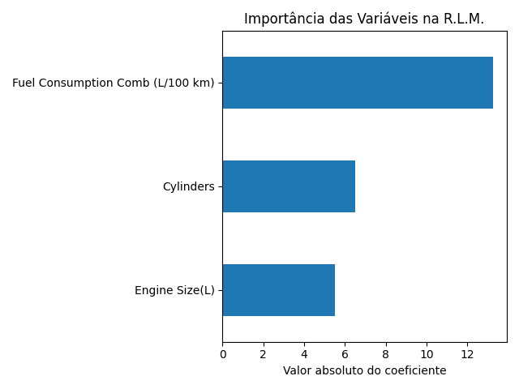

# Análise de Emissões de CO₂ de Veículos

## a) Engine Size vs CO₂
- Coeficiente angular: **36.78** 
- Intercepto: **134.37** 
- R²: **0.72** 
- **Interpretação:** cada aumento de 1 litro no motor aumenta, em média, 36.78 g/km de CO₂. O modelo explica 72% da variação das emissões apenas pelo tamanho do motor.

## b) Cylinders vs CO₂
- Coeficiente angular: **26.65** 
- Intercepto: **100.96** 
- R²: **0.69** 
- **Interpretação:** cada cilindro a mais aumenta, em média, 26.65 g/km de CO₂. O modelo explica 69% da variação das emissões apenas pelo número de cilindros.

## c) Regressão Linear Múltipla (R.L.M.)
Coeficientes:
- Engine Size(L): **5.50**  
- Cylinders: **6.49**  
- Fuel Consumption Comb (L/100 km): **13.27**  
Intercepto: **51.17**  
R²: **0.88**  
**Resumo:** O modelo múltiplo explica 88% da variação das emissões. O consumo de combustível é a variável mais relevante para prever CO₂.

